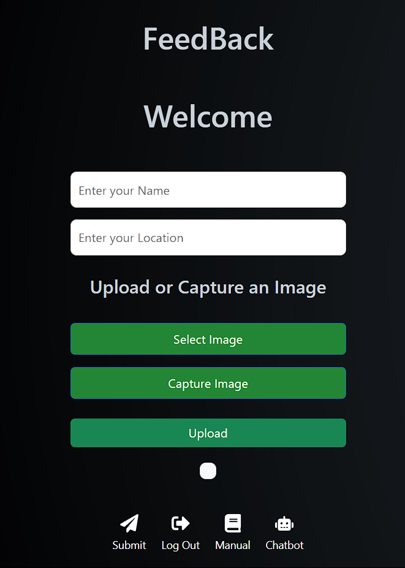
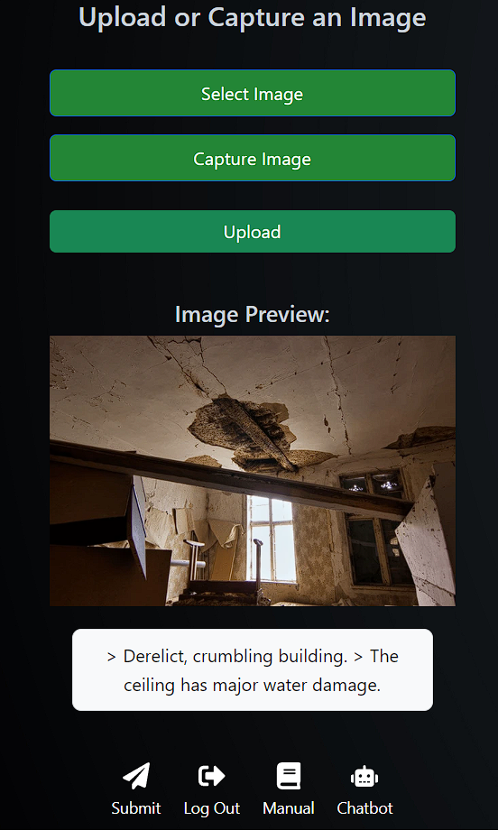
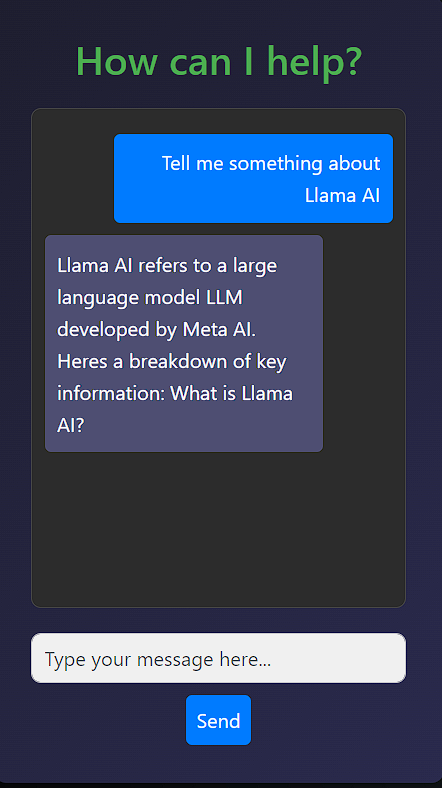
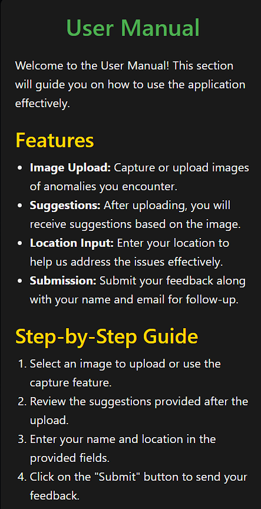
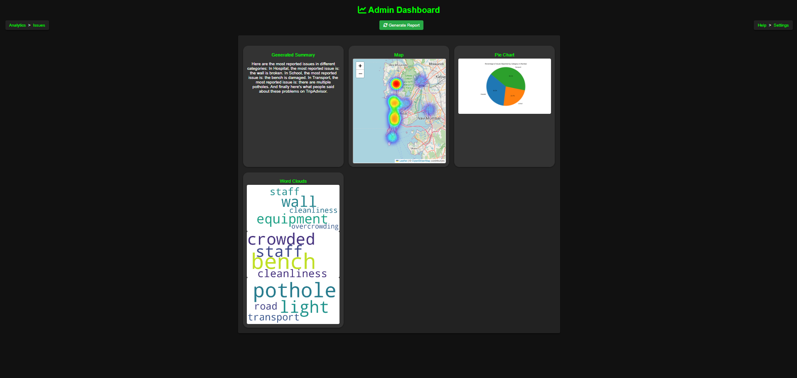

# Feedback: AI-Powered Public Feedback and Reporting Platform

## Overview

**Feedback** is a platform that allows citizens to report public service issues and anomalies using AI-powered tools. It provides a seamless way for users to submit photos of problems, with AI automatically categorizing the reports, summarizing the issues, and visualizing the data through analytics. This enables government bodies and public institutions to quickly identify and address pressing societal problems.

The platform consists of two components:
- **Client Interface**: The user-facing part where citizens can report problems.
- **Admin Dashboard**: The analytics interface where authorities can view data visualizations and summaries.

## Table of Contents
- [Features](#Features)
- [Screenshots](#Screenshots)
- [Prerequisites](#Prerequisities)
- [Setup Guide](#Setup Guide)

## Features
- AI-based image analysis and categorization.
- Automatic location detection and report submission.
- LLaMA-powered text summarization.
- Visualizations including word clouds, heatmaps, and pie charts to display data insights.

## Screenshots

### Home Page

*This is the home page of the application, offering navigation to various features.*

### Image Recognition

*Here is the image recognition feature that allows users to upload images for processing.*

### Chatbot

*This is the chatbot interface where users can interact and get responses in real-time.*

### User Manual

*This screenshot shows the user manual that guides users through the application functionalities.*

### Admin Dashboard

*The admin dashboard provides an overview of user activities and system metrics.*


## Prerequisites
- [Node.js](https://nodejs.org/) and [npm](https://www.npmjs.com/)
- [Python](https://www.python.org/) (version 3.7 or above)
- [Firebase](https://firebase.google.com/) account for backend setup
- [LLaMA API Key](https://llama.ai/)

## Setup Guide

### Client Interface

1. **Build Node Modules**
   ```bash
   cd client-interface
   npm install
2. **Setup the backend (along with Google Auth, Gemini and get API access)**
3. **Run the project**

### Admin Dashboard

1. **Setup your own Llama AI and get the API keys**
2. **Install the requiremens file**
      ```bash
   pip install -r requirements.txt
3. **Run server.py**
4. **Visit the localhost for dashboard**
